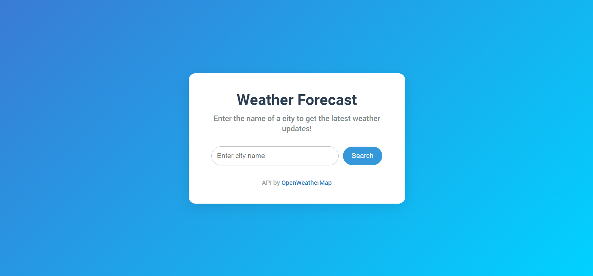
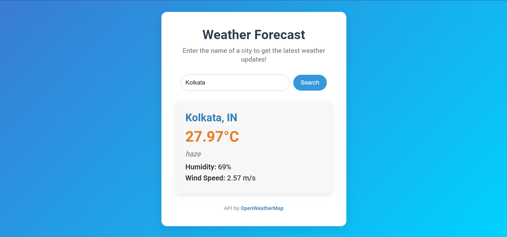

# 🌤️ Weather Forecast App

Welcome to the Weather Forecast App! This web application lets you check the current weather for any city around the world, displaying details such as temperature, humidity, and wind speed. 🌎✨


---

## 🌟 Features
- **Real-Time Weather Updates:** Get the latest weather information based on city name.
- **Detailed Weather Stats:** See temperature, weather description, humidity, and wind speed.
- **User-Friendly Interface:** Simple and clean design, optimized for all devices.

## 🚀 Getting Started

To run the project locally, follow these steps:

### Prerequisites
- Web browser (Chrome, Firefox, etc.)
- Code editor (Visual Studio Code, Sublime Text, etc.)

### Setup
1. **Clone this repository:**
    ```bash
    git clone https://github.com/(your-username)/Weather.git
    ```
2. **Navigate to the project directory:**
    ```bash
    cd weather-forecast-app
    ```

3. **Get an API Key:**
   - Sign up at [OpenWeatherMap](https://openweathermap.org/) and generate a free API key.
   - Replace the `apiKey` variable in `app.js` with your own API key:
     ```javascript
     var apiKey = 'YOUR_API_KEY_HERE';
     ```

4. **Run the app:**
   - Open `index.html` in your browser to see the app in action!

---

## 📂 Project Structure

- **index.html:** Main HTML file for the structure of the app.
- **style.css:** Styles for the app's layout and design.
- **app.js:** JavaScript for fetching data and updating the interface.

---

## 🖥️ Technologies Used

- **HTML5** for structuring content
- **CSS3** for styling and animations
- **JavaScript (ES6)** for fetching and displaying weather data
- **OpenWeatherMap API** for real-time weather updates

## 📸 Preview

Here’s a quick look at the Weather Forecast App interface:

| Initial Screen                       | Weather Display                        |
| ------------------------------------ | -------------------------------------- |
|  |  |

---

## 📝 Notes
- Ensure the `apiKey` in `app.js` is valid for weather data to display.
- This project is for educational purposes, demonstrating API integration and responsive design.

## 💡 Future Improvements
- Add a 5-day weather forecast feature.
- Show error notifications for network issues.
- Improve accessibility for screen readers.

## 🔗 Resources

- [OpenWeatherMap API Documentation](https://openweathermap.org/api)
- [CSS Flexbox Guide](https://css-tricks.com/snippets/css/a-guide-to-flexbox/)
- [JavaScript Fetch API](https://developer.mozilla.org/en-US/docs/Web/API/Fetch_API/Using_Fetch)

---

## 👨‍💻 Author

Created by [Apurba](https://github.com/Apurba2509).
